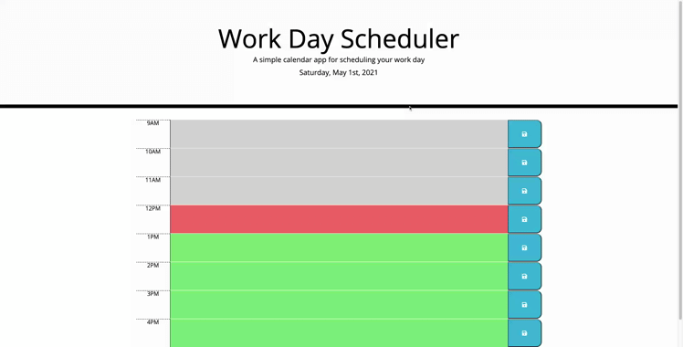

# workdayschedulerhw5
# Work Day Scheduler Homework Assignment 5 
## Michigan State University Coding Bootcamp 

Project By: 
Ian Hennessey 
GitHub Profile:  <https://github.com/atleastitsanethosman> 
Project GitHub Repository: <https://github.com/atleastitsanethosman/workdayschedulerhw5> 
Project URL: <https://atleastitsanethosman.github.io/workdayschedulerhw5/> 

## Project Description
The goal of this project was to create a day planner with the ability to make notes on events that are happening in hour blocks.  It also has formatting to show which hour blocks are in the past, present and future with different color highlights.  There is the ability to save event data in local storage so even when the page is refreshed data on the events happening in the hour blocks come back.

## Footage of Deployed Application

## Project Elements: 

1. A jumbotron element at the top displaying the current date.

2. A series of hour blocks with the ability to type events into the text area and then save them.  The hour blocks also format with grey for previous hours, red for current hour and green for future hours.

3. Data from events noted in the hour blocks are stored in local storage, and called up when the page is reloaded or the save button pressed.

4. Save buttons that expand the save icon when hovering over the button that write data from the events to local storage when pressed.

## Citations: 
Moment <https://momentjs.com/> 
jQuery <https://jquery.com/> 
Google Fonts <https://fonts.google.com/> 

## License: 
Copyright (c) 2021 Ian Hennessey
Licensed under the [MIT LICENSE](LICENSE)